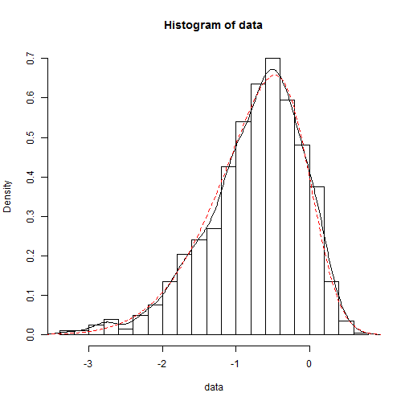
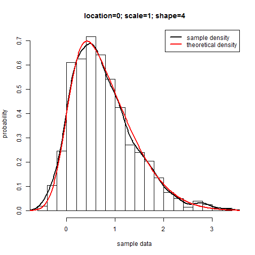

## Theoretical background
Given a random variable $X$, which has the probability denisity function
$$
\begin{equation}
f(x) = 2 \phi(x)\ \Phi(\alpha x)
\end{equation}
$$
where $\alpha$ is a number and
$$
\begin{equation}
\phi(x)= \exp(-x^2/2)/\sqrt{2\pi} ,
   \qquad \Phi(\alpha x) = \int_{-\infty}^{\alpha  x}\phi(t)\,dt
\end{equation}
$$
Set $\begin{equation}Y \: =\: \xi\, +\, \omega\, X\end{equation}$ and $Y$ is said to 
have a skewed normal distribution with parameters $\xi$, $\omega$ and $\alpha$
$$
\begin{equation}
Y\: \sim\:  SN(\xi,\,\omega^2,\,\alpha).
\end{equation}
$$
$\xi$ is called location, $\omega$ scale and $\alpha$ shape. In case $\alpha=0$ we get $Y\: \sim\: N(\xi,\,\omega^2)$ a normal distribution with mean $\xi$ and standard deviation $\omega$.
<br \>
For more information see [The Skew-Normal Probability Distribution](http://azzalini.stat.unipd.it/SN/).

--- 

## Example of a left skewed distribution


```
## Package 'sn', 1.3-0 (2015-11-11). Type 'help(SN)' for summary information.
## The package redefines function 'sd' but its usual working is unchanged.
```



--- 

## Example of a right skewed distribution



---


```
## Error in eval(expr, envir, enclos): could not find function "shinyAppDir"
```


